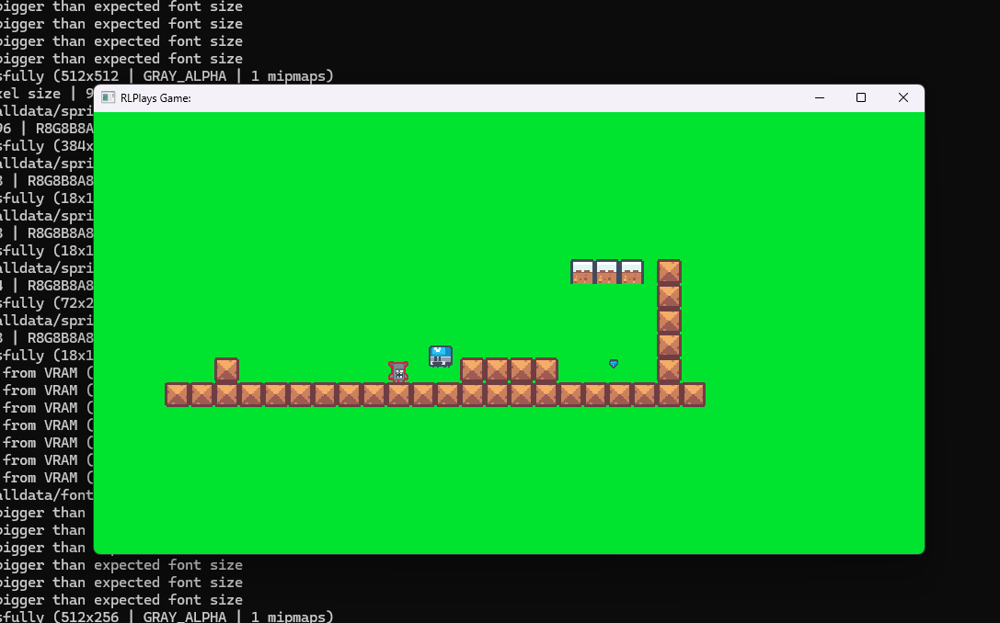
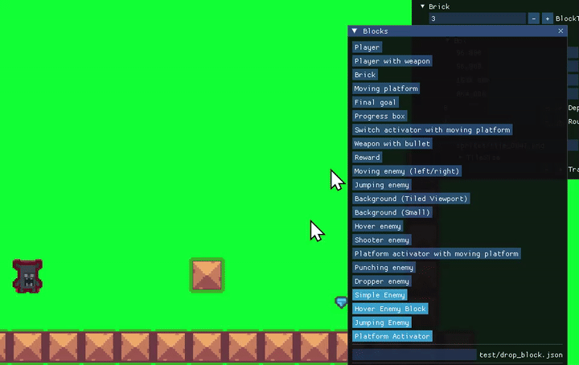
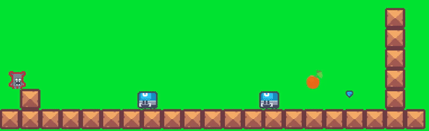
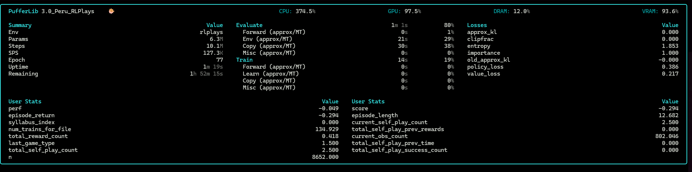

# RLPlays Game Environment

RLPlays game env helps you build 2D games - pixel platformers, shooters etc - that you can then train using [PufferLib](https://puffer.ai).


The game env is designed around:
 - An editor to create levels/maps
 - Ability to quickly create new characters/blocks/enemies and edit/preview them in the editor
 - Pipeline to train using Puffer RL library
   - Optional advanced features such as self-play, curriculum learning
 - Deploy the trained playable model on Web/Win/Lin/Mac
   - You can play against yourself (recorded actions from previous rounds)
   - You can also play against an RL agent
   - Or you can simply play as a single-player by yourself

Here is what the game looks with a fully trained RL agent with a bunch of enemies/reward/goal/blocks like:


[Check out my blog](https://rlplays.com/) for some of the rationale behind this project and also to play the game live inside the web-browser.


# Setup / Building

Use the prebuilt docker image for a quick start:

```

docker pull rlplays/rlplays:latest
docker run -d -p 3399:3389 -p 2222:22 --gpus all --name rlplays_rdp rlplays/rlplays:latest

# Connect via RDP or SSH (Change the password after connecting!)
# ssh rlplays@localhost -p 2222 (password c)
# or rdp via localhost:3399 rlplays / c
```


<details>
<summary><b>Detailed steps to setup via Docker or via local Linux here</b></summary>

> I highly discourage using WSL2 due to a variety of issues [that might hopefully be fixed in the future](https://x.com/craigaloewen/status/2061956765646979091). File I/O and importantly CUDA->dxgkrnl latency is too high to train on WSL2. Just use a Docker container *from within an actual Ubuntu pyhsical machine* to bypass Windows shenanigans.


#### Option A: Use Docker + dockerfile to build/launch the game

```
cd rlplays/docker
docker build -t rlplays:latest .
docker run -d -p 3399:3389 -p 2222:22 --name rlplays_rdp rlplays:latest
# Connect via RDP or SSH
# ssh rlplays@localhost -p 2222 (password c)
# or rdp via localhost:3399 rlplays / c
```


#### Option B:

Manually run parts of [`docker/install_deps.sh`](./docker/install_deps.sh) to install the deps for both Linux and Python manually. This is automatically installed if you use Docker instead and is safer too!

> Note: Use python venv when using the script above - Docker uses a root user as it's already isolated.
> Note: You need CUDA 12.8 (not 13) for both nvidia and torch. Check with `nvcc --version`.


## Windows/WSL2/Mac

> NOTE: I haven't trained the RL env on Windows yet, so YMMV. Use Ubuntu+NVIDIA when in doubt.

On non-Linux machines, you can run the game with the trained weights, but it's not an ideal environment to perform RL training.

For Windows: Use VS 2026 (Community) edition, open CMake project and use the target `rlplays_game` to run locally.
For Mac: The Bash script *should* work fine to launch the game, but haven't tested it much.

On Windows, use `run-build.cmd` similar to `full-build.sh`.


</details>

------


### Build/launch the game with pretrained RL weights + a sample map:

```
# In docker, cd /home/rlplays/rlplays
cd game/

# Get the latest changes in case the docker image is stale:
git pull

# Build the C++ code and run the GUI env. Requires RDP or some Ubuntu GUI to view the env.
bash full-build.sh DEBUG EDITOR RUN
```

You should see a default map open up. 




# Editor/Gameplay mode

> Press CTRL+T to toggle between the editor mode and the gameplay mode.

> Press C to switch between the RL Agent and your Player. (On Round 2 and above, you can play *against* the RL agent!)

## Useful editor commands

Start the editor/gameplay program using `bash full-build.sh DEBUG EDITOR RUN`

```
--Shortcuts--

CTRL+T to open/close the editor mode, check out the various files, edit the level etc and go back to playing it.

**Editor Mode**
Right click to select any block
 - Edit the block using the Block window
 - Use the Worlds window to load a map/level/world
 - Use the Blocks to add blocks, save/load world
 - Change the World-level parameters in the World window.

CTRL+Click/drag to resize the block 
SHIFT+Left-click/drag to move blocks
CTRL+D to delete a block
Change any property and you can preview with CTRL+T
Important: Make sure to Save World in the Blocks Window to save the file, otherwise, you will lose the changes!

```



## Using an LLM to create characters/blocks

I use Opus/Sonnet 4.x as well as GPT 5.x to create the blocks/characters - it's a lot of fun to use an LLM as it's very well suited to this task as well as adding things like confetti or scene transitions etc.

I added [`AGENTS.md`](AGENTS.md) to help with this. It's fairly easy to create these blocks manually but editing the various headers to add a new block has many manual steps - LLMs are way better at it and they produce quick/decent UIs.

Example: Given a prompt like:

 `Create a jumping enemy block that moves left and right, but when it senses a player within some radius, it moves and jumps towards them and attacks. The player can also jump and kill the enemy.` 

...any recent LLM should be able to use the AGENTS.md to generate the whole set of changes and is instantly RL trainable as well:



# RL Training Mode: Train the game using pufferlib

All the [RL code is isolated](./game/rlplays/) so the game env itself is standalone/playable/tweakable. The RL code has an environment glue code to stitch the RL env via actions/obs/rewards/goal (in [rl_env.h](./game/rlplays/include/rl_env.h) - it's a bit messy as I was experimenting with curriculum learning, self-play and various forms of obs).

> Note: I have a [forked version of pufferlib (3.0) with my own native multithreading code](https://github.com/rlplays/PufferLib) in `game/thirdparty/PufferLib/`. I haven't ported to 4.0 yet.


```
cd /home/rlplays/rlplays/game

# To just retrain (convert all the world files and ensure obs size etc is correctly setup in rlplays.ini):
bash rlplays/build_rl_train.sh BUILD CONVERTER TRAIN

# To use WandB - https://wandb.ai/settings#apikeys and run `wandb login` first
bash rlplays/build_rl_train.sh  WANDB BUILD CONVERTER TRAIN
```

You should see the training TUI like this:



> TODO: This uses Puffer 3.0; porting to 4.0 requires a resweep (took me several days/almost a week for the 3.0 sweep!) which is the main time consuming step I haven't invested as I don't have a powerful enough GPU to train it.

Once the training is done, it automatically places the trained `.bin` file so you can start playing. You can also watch a 'ghost player' show the highlight reel from the training mode if you use the right file in [ghost_player.h line 137](./game/plays/ghost_player.h). Use CTRL+ 1, CTRL + 2, CTRL + 3 to show the debug ghost player views - you need to open the correct level to see the ghost player.

## Advanced RL Features

These are a few features I was toying with - I am not an RL researcher so these are mostly toy research expeditions that I am not fully confident is the right way to do things, but it turned out to be a lot of fun for myself mostly. YMMV.

### Self-play

You can add a second player (with a different player index) into a map and that can play against you (a) via an RL agent (b) or using your recorded actions from a previous round. (You can configure the rounds to try out self-play yourself before training with Puffer).

This self-play by itself (e.g. `rlplays_level4.json`) would show super human characteristics as it learns by battling itself. Adding more enemies, interesting blocks etc would result in some quite interesting behaviors emerge out of simply having the RL algorithm beat itself over a long period of time.

### Curriculum learning

I did a dumb version of curriculum training by having a [level ladder](./game/editor/alldata/worlds/worlds.json#520) that an RL agent would have to climb as it trains on increasingly more difficult levels starting with a few simple blocks/enemies/rewards. You can see `syllabus_index` in the Puffer dashboard TUI (or in WandB) as it hill climbs the various levels. I also tried having simpler levels after training on harder levels to ensure it can master the levels correctly.

> NOTE: The resulting code is research-level crappy code unfortunately as I was experimenting quite a lot with various ways to understand how the RL agent behaves in a realistic playable environment.

# Tests

Game tests are in [tests](./game/tests/) and RL Tests are in [rlplays/tests](./game/rlplays/tests/). Use `bash full-build.sh TEST` or `bash full-build.sh PUFFER_TEST` to run the relevant tests. I mainly added `PUFFER_TEST` as that was my primary way to test the [multithreading/GPU batching code I was experimenting with](https://rlplays.com/posts/puffer-opt/).

## Assets

I have included the minimal assets from Kenney.nl as this repo is strictly to understand/train using RL - you can download the full assets from [www.kenney.nl](https://www.kenney.nl).

Please consider donating/buying the full asset pack if you find it useful.


# Thirdparty code

I have included the actual code instead of a complicated `git submodule` setup which is finicky.

Here are the actual thirdparty code in `game/thirdparty/`:
- PufferLib - Main RL training+eval - Using my forked 3.0 branch native multithreading here https://github.com/rlplays/PufferLib
- Raylib - for all the graphics, input and tons of amazing utils. https://raylib.com
- Dear ImGui - for the editor UI, integrated via `raylib_imgui` - https://github.com/ocornut/imgui/
- Kenney.nl - minimal pixel platformer assets included (CC0) - https://kenney.nl/assets
- json - serialization library - https://github.com/nlohmann/json
- emsdk - for the web build - https://github.com/emscripten-core/emsdk

Please check [`THIRDPARTY.md`](THIRDPARTY.md) for the specific licenses.

Although PufferLib is in thirdparty, it's mostly to isolate the github fork as a submodule. It's a core part of the env though.


### NOTES

Add converter notes
Editor notes
RL Training notes
 - Increase num threads/gpu batches/bptt_horizon etc