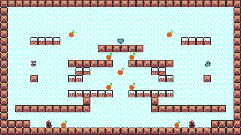

# RLPlays Game Environment - Explore RL using a 2D game

RLPlays game env allows you to build 2D games - pixel platformers, shooters etc - that you can then train using PufferLib.

It supports optional advanced features such as self-play, curriculum learning and so on.

The game is designed around (a) an editor (b) create characters/blocks.

Here is what the game looks with a fully trained RL agent with a bunch of enemies/reward/goal/blocks like:



**Basic Structure**


# Setup / Building

> TIP: Use a Ubuntu GUI Docker container to setup as Python deps + nvcc/cuda + C++ combo is hard to track; plus isolation helps you avoid messing up your machine / supply-chain attacks.

To start off:

```
git clone https://github.com/rlplays/rlplays


```

## Ubuntu

> I highly discourage using WSL2 due to a variety of issues [that might hopefully be fixed in the future](https://x.com/craigaloewen/status/2061956765646979091). File I/O and importantly CUDA->dxgkrnl latency is too high to train on WSL2. Just use a Docker container *from within an actual Ubuntu kernel* to bypass Windows shenanigans.


> NOTE: You need a machine with NVidia+CUDA to train the RL environment.

#### Option A: Use Docker + dockerfile to build/launch the game


#### Option B:


```
apt-get update && apt-get install -y   build-essential g++ git wget libx11-dev  xorg-dev libxrandr-dev   libxinerama-dev libxcursor-dev libxi-dev curl jq libc++1 libc++abi1 
```

------

Next:

To launch the game with pretrained RL weights + a sample map:

```

```


## Windows/WSL2/Mac

> NOTE: I haven't trained the RL env on Windows yet, so YMMV. Use Ubuntu+NVIDIA when in doubt.

On non-Linux machines, you can run the game with the trained weights, but it's not an ideal environment to perform RL training.

For Windows: Use VS 2026 (Community) edition, open CMake project and use the target `rlplays_game` to run locally.
For Mac: The Bash script *should* work fine to launch the game, but haven't tested it much.


## Web

TODO

# Editor: Create blocks and edit levels

## Using an LLM to create characters/blocks

I use Opus/Sonnet 4.x as well as GPT 5.x to create the blocks/characters - it's a lot of fun to use an LLM as it's very well suited to this task as well as adding things like confetti or scene transitions etc.

I added [`AGENTS.md`](AGENTS.md) to help with this. It's fairly easy to create these blocks manually but editing the various headers to add a new block has many manual steps - LLMs are way better at it and they produce quick/decent UIs.

## Editor Shortcuts

`CTRL+T`: Open/close editor mode (only on desktop)


# Tests


## Game tests

## RL tests


## Assets

I have included the minimal assets from Kenney.nl - you can download the full assets from [www.kenney.nl](https://www.kenney.nl).
Please consider donating/buying the full asset pack if you find it useful.

# Thirdparty code

I have included the actual code instead of a complicated `git submodule` setup which is finicky.

Here are the actual thirdparty code in `game/thirdparty/`:
- PufferLib - Main RL training+eval - Using my forked 3.0 branch native multithreading here https://github.com/rlplays/PufferLib
- Raylib - for all the graphics, input and tons of amazing utils. https://raylib.com
- Dear ImGui - for the editor UI, integrated via `raylib_imgui` - https://github.com/ocornut/imgui/
- Kenney.nl - minimal pixel platformer assets included (CC0) - https://kenney.nl/assets
- json - serialization library - https://github.com/nlohmann/json
- emsdk - for the web build - https://github.com/emscripten-core/emsdk

Please check [`THIRDPARTY.md`](THIRDPARTY.md) for the specific licenses.

Although PufferLib is in thirdparty, it's mostly to isolate the github fork as a submodule. It's a core part of the env though.


