## Multithreaded Libtorch fork of PufferLib 3.0
 Main repo: https://github.com/rlplays/pufferlib

> 
>**DO NOT USE THIS YET** 
>
> Still in-progress. Go to https://puffer.ai  or the main repo https://github.com/pufferai/pufferlib
>
 

This repo contains a C++-native version of `evaluate` that uses libtorch + CUDA streams + threads to sub-linearly scale the core `eval<->train` loop.

Comparison between the previous Multiprocessing backend (2 procs) and the native multithreading backened (using 8 CUDA threads/12 env threads) using the same number of envs/steps/etc:


| Game/Env    | 2080 RTX         |                   | 4090 RTX         |                   |  
|-------------|:----------------:|:-----------------:|:----------------:|:-----------------:|
|             | **MultiProc**        | **NativeMT**            | **MultiProc**          | **NativeMT**          |
| go          | 580K SPS           | 1.8M SPS          |  794K SPS          |    1.8M SPS      | 
| breakout    | 1.2M SPS           | 4.5M SPS          |  3.9M SPS          | 6.1M SPS        |
| pong      | 1M   SPS           | 3M SPS            |  3.2M SPS            | 6.2M SPS               |


* I used 4090 RTX from Puffer/Joseph's lab. `runpod/vast.ai` 4090RTX etc have terrible cuda launch latencies (~4-6x slower) and not useful for RL training.

Some more data on just the 2080RTX card:
| Game/Env    | 2080 RTX         |                   |   |
|-------------|:----------------:|:-----------------:|:--:|
|             | **MultiProc**        | **NativeMT**            | _Notes_|
| g2048       |   2M SPS                 |  **1M SPS**                |   Much slower because `uint8_t` obs vs `float32` obs / 4x bandwidth (haven't supported uint8 yet) |
| pacman      | 1.5M   SPS           | 2.9M SPS            | |
| rlplays     | 25K  SPS           | 130K SPS          | Large GPU batch + 'fat' env (will open-source once cleaned up) | 


**TL;DR Summary of optimizations**

- **Independent Multithreading for GPU batches and envs**
  - Multi-threaded GPU Batches each with its own CUDA stream (depends on the GPU cores / GPU bandwidth) - batched segments within a horizon proceed sequentially in parallel to other batches.
    
  - Multi-threaded Env steps on the CPU.

- **Fused kernels with `out` `Tensor`s**

  - Fused kernels for sampling logit & value/decoder networks; internal libtorch functions for encoder/lstm.

- **Preallocated tensors**
  - Avoids CUDA caching allocator; no Tensor allocs during the forward pass.

- **Micro-optimizations pursuing Amdahl's law**
  - Efficient use of threads to set things up, moving things into CPU/GPU as needed, and being careful with CUDA / CPU memory allocs.


<details>
<summary>Added Profiling Tools/Tests</summary>
 - Added `scripts/test_cuda_perf.py` to test out bandwidth/FLOPs/launch kernel costs. Quick-n-dirty benchmarks when testing out on a vast.ai/runpod.io machine for comparison purposes.
 - Added `scripts/start_profile_env.sh` to profile multiple envs including the full/partial eval/train loop:
   - Profile just eval or eval+train with different `--vec.backend` etc CLI params.
   - (Optional) Outputs the CUDA profile (.json-> ui.perfetto.dev) along with useful stats into a text file.


 - Misc stuff  
   - Single threaded mode (non-multi-threaded version for debugging via `#define PUFFER_SINGLE_THREADED 1`)
   - 'cuda memcheck' mode in C++ that outputs which of 'our' tensors are being cached by the CUDA caching allocator `#define PUFFER_CUDA_MEMCHECK 1`
   - Micro benchmarks (see `PerfTimer`) + tensor comparisons inside the core C++ code to test stability and performance with realistic data/harness.
   - Timing etc wired up to the main python-side so the dashboard/profile all work seamlessly. 
   - Also added `GTest` tests (outside of the repo as it uses CMAKE etc) to verify the core logic especially as I convert existing lstm/encoder -> new ops/GPU patterns.
</details>

****

# Full Optimization details - `Measure, Analyze, Optimize`

If you are not familiar with Puffer/RL, read this system-centric overview first (the full Puffer docs are at https://puffer.ai/docs.html):

<details>
<summary> Overview of RL / Puffer </summary>
Each iteration of the Puffer RL loop does `evaluate` first followed by `train`. `train` generates the neural network parameters for the evaluate to run the envs with.

The core eval loop looks like this:


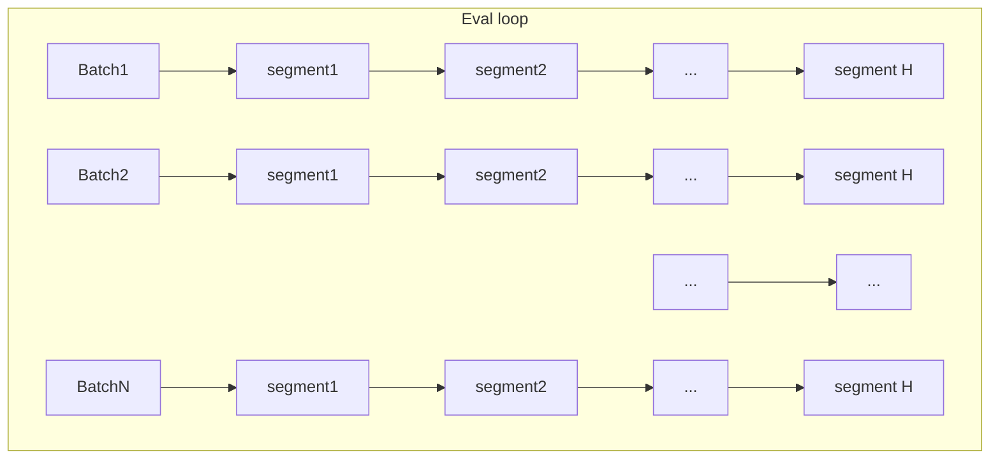


Each eval iteration collects a _horizon_ of `H` BPTT (back-prop through time) segments. Typically `H` is a nice power-of-2 number like 64. Each horizon's segments runs through this forward->actions->logits->run_envs loops sequentially. Each segment runs/collects `N` environments' observations/actions/rewards/terminals (a segment looks like this expanded out):

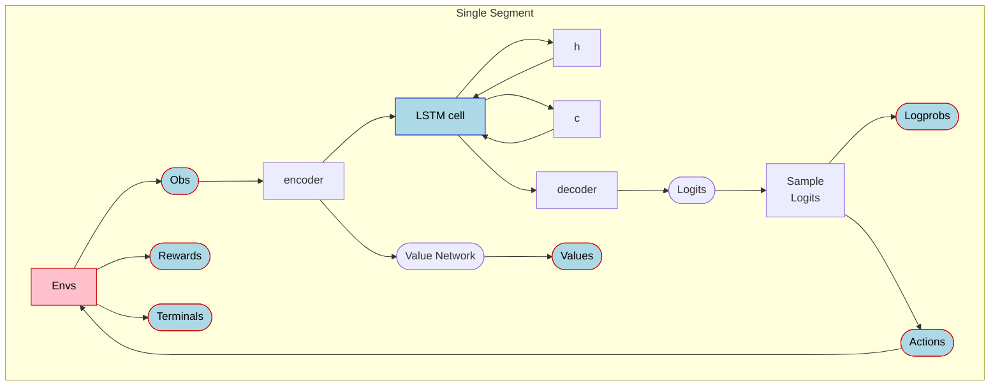

<br/>
The forward pass in Puffer uses an LSTM network (typically 128x128 h/c configuration). For (multi)discrete envs such as `breakout`, the forward pass produces a `value` and `logits` the latter of which can be sampled from into `actions` fed into the envs.

The existing Puffer `multiprocessing` backend performed parallel running of envs + forward loop inside `eval` (double-buffered env runs while the GPU does the forward pass). The envs are written in C, the eval/training code is in Python/PyTorch (with a custom CUDA kernel for the PPO advantage function).

</details>

---

Let's dig into a PyTorch trace/profile to look for optimizations in the `eval` loop (`train` is a different kind of beast, we will explore that at a later date).
All profiles/notes are for `puffer_breakout` running on a machine with 4090 RTX.


<details>
<summary>Profiler notes</summary>

I added this script (in PufferLib/scripts) to profile envs with different backends/train/eval loops etc that also produces detailed timing info both from within the Py/C code as well as from CUDA.
```
bash scripts/profile_envs.sh puffer_breakout --profile.train 0 --profile.trace 1 --vec.backend Multiprocessing --profile.name multiprocessing
# Tip: You can provide multiple envs separated by comma e.g. puffer_breakout,puffer_go
```

This also uses the pytorch profiler to generate a .json file you can open with [Perfetto](https://ui.perfetto.dev/) - we will use this perfetto snapshots extensively to analyze performance (compute/bandwidth/memory).
</details>

<br/>

First off, the multiprocessing backend looks like this under the profiler:

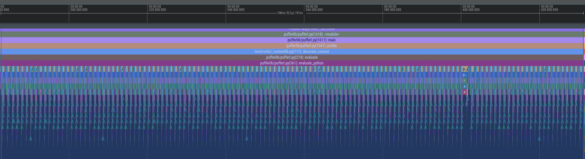

This shows the eval loop running two batches of 64 segments sequentially (`forward pass`+`run_envs`) taking a total of 143 ms on a 4090 RTX machine for the [`puffer_breakout`](https://puffer.ai/game.html) env (`~2.23ms` per horizon for two batches of 4096 envs each / `~1.17ms` per horizon per batch).

Let's zoom in a bit into the forward+sample_logits parts to analyze the trace for (a) what takes the most time (b) where to optimize:

Here is the forward pass for a single segment (for a single batch with 4096 environments) (takes `~204us`).

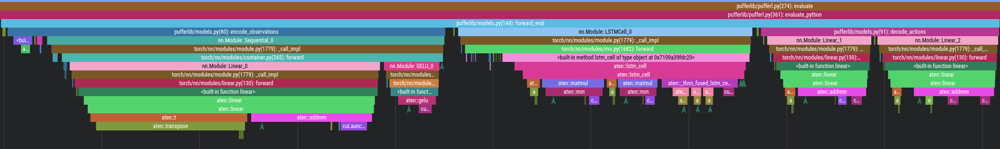


Here is the sample logits based on the output of the forward pass (takes `~304us`)

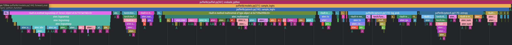

As the environment generates obs, we have to transfer them to the GPU to run the forward pass with to generate logits/logprobs/values (takes `~196us`).


Current tally: Eval full horizon takes **~143ms** per eval loop iteration.

| Multiproc Eval breakdown for<br/>puffer_breakout on 4090RTX | Time| Notes |
|-------------|:----------------:|:---|
| Copy Host-To-Device <br/>*Obs/Rewards/Terminals*      | `217 us` |  `~195 us` (obs) + <br/>`~22 us` (rewards/terminals)|
| Encoder <br/>_Obs -> Hidden_                | `64 us` |  |
| Forward<br/>*LSTM hidden/h1/c1 -> h2/c2*      | `60 us` | h2/c2 for segment1<br/> become h1/c1 for segment2 etc |
| Decoder/Value<br/>_h2-> ... ->Values/Logits_          | `46 us`  |
| Sample Logits<br/> _Logits->Logprobs/Actions_ | `344 us` |
| Run envs<br/>send actions->recv obs  | `~460 us` | 
| *Total (per segment)*   | `1117 us` | * 64 segments * <br/>2 batches  = 143ms per horizon|


We now have a good view of where the biggest time sinks are (follow Amdahl's law). We can now pursue optimizations...


## Optimization 1: Multi-threaded environments

Each horizon runs H segments sequentially. Each segment runs N environments. We can parallelize the N environments. (This is how I started this set of optimizations BTW - it snowballed into a nice Advent of Code-style puzzles.)

| | | | 
|-------|:-----:|:---:|
| **Multiproc** Eval <br/> |  143ms   | 64 segments <br/>(2 batches of 4096 envs / batch) |
| **Multithreaded** Envs <br/>Envs are run in parallel| 79ms | 64 segments <br/> 1 batch 8192 total envs <br/> 12 threads|
| | `~1.8x` speedup   | | 

This is simply spreading the load across the available cores. This code is in [`puffer_threads.h`](https://github.com/rlplays/PufferLib/blob/puffer-mt-evallibtorch/pufferlib/ocean/puffer_threads.h) which uses one lock per batch of envs (each thread is alloted `T/N` envs where T is # of threads, N is # of envs). `PufferOptions` controls the number of threads T based on number of physical cores from the Python code.


## Optimization 2: Multi-threaded GPU batching


Two of the major bottlenecks inside the segments are 
 - Transferring CPU (obs/rewards/terminals) -> GPU 
 - Running the forward pass once the data is in the GPU

One key insight is that while a horizon *must* run the segments _sequentially_, batches of horizons can be run in parallel.


We can parallelize the GPU batches (copy+ops) using the same multithreaded infra from the previous optimization. 
Each batch of B envs copies the obs/rewards/obs to the GPU; followed by running the forward pass/logit sampling; and then scheduling the B envs to be run using the prior multithreading independently.


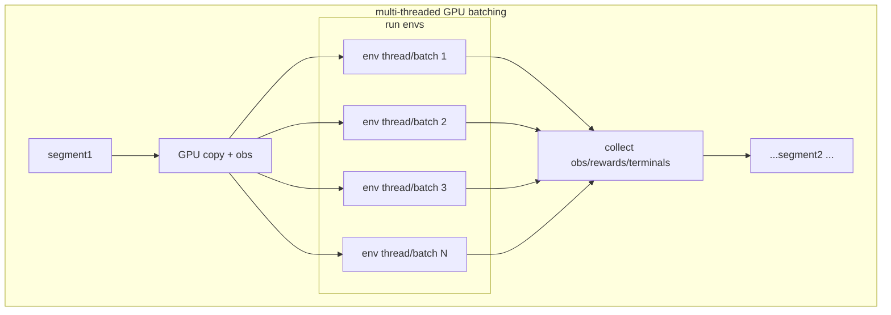

We can parallelize via multithreading such that each batch runs in parallel with the others, while the segments within a batch run sequentially. (By sequentially, we follow the typical `async/Promise` model where `.then()`-like model schedules the next segment on any freely available thread/CPU core).

There are a few gotchas:
 - By default, each thread gets its own CUDA stream (TLS-based). However, we want Batch B1 to not fight (`cudaSynchronize`) with Batch B2 if they end up in the same thread.
    - *Solution:* Each batch gets its own CUDA stream regardless of which thread it ends up in (upto a [max of 32 cuda streams](https://github.com/pytorch/pytorch/blob/main/c10/cuda/CUDAStream.h#L11))
 - With multiple custom streams, the CUDA caching allocator will pool memory in a way where we will OOM frequently. This is either a bug or a `feature` of the CUDA caching allocator.
   - *Solution:* Preallocate Tensors and avoid the PyTorch `CUDACachingAllocator` (this is a big optimization in and of itself, we will dive deeper later). This also results in nice benefits as we conserve `cudaMemCpyAsync` and `cudaStreamSynchronize` calls too. This is a much larger engineering effort though.
   - *Tried/Not considered:* You can play with [PyTorch flags for CUDA caching allocator](https://docs.pytorch.org/docs/stable/notes/cuda.html#optimizing-memory-usage-with-pytorch-cuda-alloc-conf) but you will hit a wall as the caching allocator does not work well with multithreaded CUDA streams as of this writing.

After making this series of optimizations, we get the overall speedup:


| | | | 
|-------|:-----:|:---:|
| **Multiproc** Eval <br/> |  143ms   | 64 segments <br/>(2 batches of 4096 envs / batch) |
| **Multithreaded** Envs <br/>Envs are run in parallel| 79ms | 64 segments <br/> 1 batch 8192 total envs 12 threads|
| | `~1.8x` speedup   | | 
| **Multithreaded batching** <br/>GPU batching+Multithreaded Envs| 38ms | 64 segments <br/> 8 GPU batches on 8 batching (CPU) threads <br/> 8192 total envs (12 env CPU threads) |
| | `~3.8x` total speedup   | | 


This also scales nicely: throw CPU cores/GPU cores/bandwidth (i.e. high-end nvidia chips like 5090RTX etc) at the problem, and the speedup scales.

To really see why this is the case, let's look at the CUDA graphs of before / after. 

With the existing backend (`Multiprocessing`) that uses serialized, single-thread GPU batching of copy/gpu ops, it looked like this:


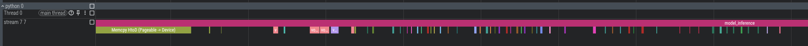

...a single CPU thread managing a single CUDA stream with serialized copy+GPU ops.

Here is the new multi-threaded GPU batching that shows how the ~3.8x speedup was possible:

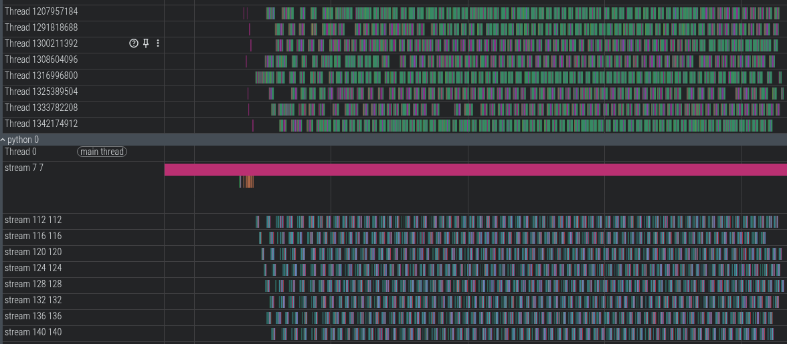


You can see the 8 GPU batches being scheduled by the 8 CPU threads. GPU copies (HToD/DToH) for a batch/segment can overlap with GPU ops for other batches/segments using 8 independent CUDA streams.

Let's zoom in a bit:

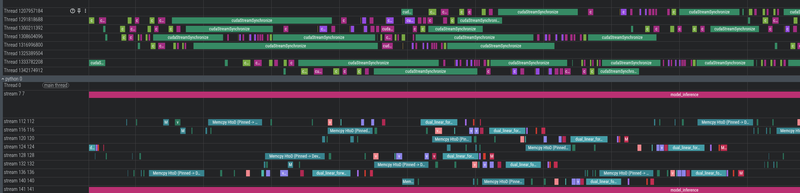

Note how the GPU ops for the first two threads are scheduled in parallel (as not all cores are being used by a single kernel). This also hides the `cuda launch kernel` latency.


>  **NOTE**: For chips such as nvidia 4090 RTX, there is only one GPU copy engine so the copies _between_ segments themselves cannot overlap. GPU ops and copies do overlap. So if you look closely at this profile, there is at most one HostToDevice copy or DeviceToHost copy at any given time (HToD can overlap with DToH btw as PCIe is bidi).

(Note: all profiling done on the same 4090 RTX machine for `puffer_breakout` env with different backends; running `-O3`'ed C code).


### GPU Batch size scaling effect
Here is the effect of scaling via different batch sizes and CPU thread counts:

4090 RTX breakout / 24 physical cores (*2 NUMA) 8192 envs


|         |           |                   |                  |                   |  | | | | |
|-----------------|:----------------:|:----------------:|:----------------:|:-----------------:|:----------------:|:----------------:|:----------------:|:-----------------:|:-----------------:|
| # GPU Batches   | # CPU Env threads |  LSTM Forward  (Eval) (ms) <br/> \*\*(total per epoch) | Copy (Eval) (ms) <br/>\*\*(total per epoch) | Env CPU (Eval) (ms) <br/>\*\*(total per epoch) | SPS <br/> Eval+Train           | Total wall-clock time(ms) / epoch <br/>Eval+Train |       Notes    |   
| 1     | 8           |  2.3 ms       | 28.8 ms | 81.6 ms |     3M SPS                 | 175 ms                |   Serial-like |
| 2     | 8           |  4 ms         | 31.9 ms | 78.6 ms |    4.5M SPS                | 116 ms                |  Multiproc-like |
| 4     | 8           |  11 ms        | 54.4 ms | 74.5 ms |    5.6M SPS                | 93 ms                |  |
| **8**    | **8**    |  36 ms        | 101.9 ms| 63.2 ms |     **6.1M SPS**           | **86 ms**<br/>(Eval 34ms / Train 52ms)<br/>                |  **Right batch/thread-count<br/> for PCI bw/env size**|
| 12     | 8          | 30.5 ms       | 120.8 ms | 75.5 ms|      6M SPS                | 88 ms                |  Per-batch transfer<br/>size is too small |
| 8     | 1           | 12.2 ms       | 39.5 ms | 94.6 ms |     3.7M SPS               | 141 ms                | Fixed batch-size<br/>Exp w/ CPU env threads|
| 8     | 2           | 13.9 ms       | 42.1 ms | 84.3 ms |     5.2M SPS               | 100 ms                | |
| 8     | 4           | 15.3 ms       | 63.3 ms | 65.3 ms |     5.9M SPS               | 88 ms                | |

**Note** (\*\*) Total time is across multiple threads. It's meaningful to compare numbers within the same batch-size (LSTM/Copy) or same env-thread-size (Env CPU) but not across different batch/thread sizes. However, `Total wall-clock time (ms)` measures end-to-end time per eval+train epoch.

The (\*\*) numbers are a bit deceptive: it looks like as we increase batch-size from 1->2->4, the LSTM forward takes 2.3 ms -> 4 ms -> 11 ms. However, batch size 1 = 8192 envs (scheduled from 1 CPU thread onto the GPU), batch size 2 = 4096 envs each, with 2 threads. By using 2 GPU threads, the total wall clock time reduces from 175ms -> 116ms (for total eval+train). While the per-batch numbers are useful to understand as we make targeted micro-optimizations (like using fused CUDA kernels), the wall-clock time is the real meaningful number when looking at things like multi-threaded GPU batching and so on. The CUDA profile in ui.perfetto.dev will also show how the threads overlap to 'save' time over the course of an epoch as these batches / segments in a horizon proceed independently from each other.

----

In the following sections, we will look at *micro-optimizations* as the overall optimizations are now setup.

## (Micro-)Optimization 3: Use preallocated tensors with `_out` CUDA kernels

As I noted earlier, the CUDA caching allocator does not meet our needs especially when combined with multiple streams+multithreading. This _constraint_ forces us to find creative solutions to manage memory. For reference, here is the core forward `libtorch/PyTorch` functions look like (from [`models.py`](https://github.com/rlplays/PufferLib/blob/puffer-mt-evallibtorch/pufferlib/models.py#L72)):

```python
# PyTorch Python code but this is wlog the same in C++ libtorch as well.
def forward_eval(self, observations, h1, c1):
  hidden = self.encoder(observations)
  h2, c2 = self.cell(hidden, (h1, c1))
  logits = self.decoder(h2)
  values = self.value(h2)
  return logits, values, h2, c2
```

Note how each function takes in a `Tensor` as input and outputs (creates) a new `Tensor`. In an ideal world, especially given how batches are shaped, the output tensors are used as intermediate tensors, thrown away after this segment is done by the PyTorch allocator. However, with multiple CUDA streams + multiple threads the allocator maintains the `Tensor` memory for much longer.

I did a memory profile using [this awesome tool](https://pytorch.org/blog/understanding-gpu-memory-1/). 

<details>
<summary>Memory Profiler notes</summary>

```sh
# To use the PyTorch memory profiler, you must not use the CPU / GPU profiler and must ensure that the multithreading is off (set `-DPUFFER_SINGLE_THREADED=1` in `setup.py` or in the `puffer_threads.h`)
bash scripts/profile_envs.sh puffer_breakout --profile.train 0 --profile.trace 0 --profile.name memory_profile --profile.memory 1
```

</details>

----

Here is the memory profile when using the default CUDA caching allocator with multiple streams:

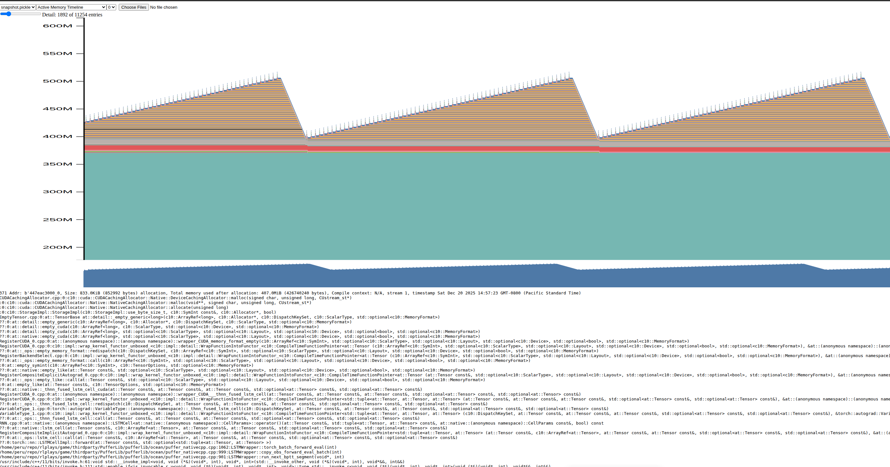

The saw-tooth shape means memory is not relinquished past a segment/batch (or even past *several horizons*). This is hugely problematic as PyTorch mistakenly keeps accumulating these Tensors (and for fat envs, it actually OOMs or worse, trashes memory due to fragmentation). (Seeing a sawtooth shaped memory chart usually is a symptom of a memory leak, which is very well the behavior of the CUDA caching allocator here).


This problem is also present regardless of single/multi-threaded.


In order to avoid the CUDA caching allocator, we have to preallocate `Tensor`s and _pass them in_. Preallocating Tensors is 'easy' because we know exactly the horizon length (# of segments), batch size, # of envs, neural network inputs/outputs/weights/biases ahead of time per horizon. However, _passing them in_ to libtorch is not so easy. PyTorch/libtorch (rightfully) hide these internal functions because of (a) autograd (b) supporting multiple devices.

However, we don't need autograd during `evaluate` and we are only targetting nvidia chips here. 

[Here is an example](https://github.com/rlplays/PufferLib/blob/puffer-mt-evallibtorch/pufferlib/ocean/puffer_native.cpp#L720) of how, say, `self.encoder` (a linear layer + GELU) is transformed:

```cpp
  // This is in puffer_native.cpp
  at::_addmm_activation_out(state->hidden_transposed, encoder_bias, encoder_linear->weight,
    state->obs_device, 1, 1, /*use_gelu*/ true);
```

`state->hidden_transposed` is a preallocated tensor passed to this `_out` variant that is used by the `self.encoder` code above.

We have to convert the entire forward pass (encoder, decoder, LSTM cell plus `sample_logits`). I used custom CUDA kernels + `_out` to achieve that (see the other micro-optimizations below for details). Here is how the new memory profile looks:

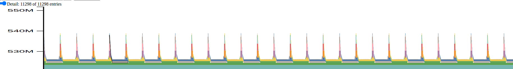

Note how the sawtooth shape is now flattened. However, the 'base' of the graph is higher because we have preallocated those tensors and cuda caching allocator is out of our way.

(I am showing an earlier version of the profile before I did more optimizations, so even the small intermediate allocs shown here are mostly gone).

This also nets us a nice benefit in terms of CPU cost (as we don't invoke the `cudaMemCpyAsync/cudaMemAlloc/cudaStreamSynchronize` calls as well as the libtorch overhead). We are also 'forced' to fuse CUDA kernels which further reduces `cudaLaunchKernerl` overhead along with pure GPU ops cost (described in further sections).


<details>
<summary>Microbenchmarking tools/notes</summary>

I used several microbenchmarking tools. 

* First: I added a simple C++ `PerfTimer` that produces stats like this as part of the core loop (in CPU time):

```
encoder_forward  took 212130.936000ms    [ For 10000 iters; avg : 21.213094us; stddev : 3.923497us ]
encoder_addmm    took 184244.787000ms    [ For 10000 iters; avg : 18.424479us; stddev : 3.446059us ]

value_forward    took 72694.727000ms     [ For 10000 iters; avg : 7.269473us; stddev : 1.825029us ]
value_addmm      took 68694.117000ms     [ For 10000 iters; avg : 6.869412us; stddev : 291.338036ns ]
value_cudakrnl   took 77500.745000ms     [ For 10000 iters; avg : 7.750074us; stddev : 2.439263us ]

```

* I also used the libtorch/cuda profiler using `pufferl --profile` / `start_profile_envs.sh` script that looks at the overall CPU/GPU (CUDA) times as well:

```
-------------------------------------------------------  ------------  ------------  ------------  ------------  ------------  ------------  ------------  ------------  ------------  ------------  ------------  ------------  ------------  ------------  --------------------------------------------
                                                   Name    Self CPU %      Self CPU   CPU total %     CPU total  CPU time avg     Self CUDA   Self CUDA %    CUDA total  CUDA time avg       CPU Mem  Self CPU Mem      CUDA Mem  Self CUDA Mem    # of Calls                                  Input Shapes
-------------------------------------------------------  ------------  ------------  ------------  ------------  ------------  ------------  ------------  ------------  ------------  ------------  ------------  ------------  ------------  ------------  --------------------------------------------
fused_lstm_cell_kernel(float const*, long, long, flo...         0.00%       0.000us         0.00%       0.000us       0.000us        2.887s        67.94%        2.887s       2.256ms           0 B           0 B           0 B           0 B          1280                                            []
                                        model_inference         0.00%       0.000us         0.00%       0.000us       0.000us        2.463s        57.95%        2.463s        2.463s           0 B           0 B           0 B           0 B             1                                            []
void at::native::elementwise_kernel<128, 2, at::nati...         0.00%       0.000us         0.00%       0.000us       0.000us     406.543ms         9.57%     406.543ms      63.522us           0 B           0 B           0 B           0 B          6400                                            []
dual_linear_forward_kernel(float const*, long, long,...         0.00%       0.000us         0.00%       0.000us       0.000us     294.467ms         6.93%     294.467ms     230.053us           0 B           0 B           0 B           0 B          1280                                            []
                         Memcpy HtoD (Pinned -> Device)         0.00%       0.000us         0.00%       0.000us       0.000us     224.239ms         5.28%     224.239ms      58.396us           0 B           0 B           0 B           0 B          3840                                            []
                                  volta_sgemm_32x128_tn         0.00%       0.000us         0.00%       0.000us       0.000us      56.357ms         1.33%      56.357ms      44.029us           0 B           0 B           0 B           0 B          1280                                            []
void at::native::reduce_kernel<512, 1, at::native::R...         0.00%       0.000us         0.00%       0.000us       0.000us      49.051ms         1.15%      49.051ms      38.321us           0 B           0 B           0 B           0 B          1280                                            []


```

* The profiling script also outputs the nice .json visualizable using ui.perfetto.dev to dig into different sections.

</details>

-----

I used the internal LSTM impl + `addmm_activation_out` to replace the encoder/LSTM. However, the decoder and the sample logits present new opportunities to optimize even further.
This code is in [puffer_native.cpp](https://github.com/rlplays/PufferLib/blob/puffer-mt-evallibtorch/pufferlib/ocean/puffer_native.cpp#L720) `cuda_batch_forward_eval`. I closely measured/analyzed/optimized using the micro-benchmark tools I mentioned above. After a round of optimization, I had tests that ensured the optimized outputs (closely) matched by comparing against `old_lstm_network_forward_eval`. Note e.g. the GELU approximation (tanh) / linear forward are closer to how the eval actually works after training than before - so there is some precision loss. But I ensured the final training perf/score (for the same number of steps/envs) is the same.

## (Micro-)Optimization 4: Use fused CUDA kernels for sample_logits/decoder

The `sample_logits` and the `decoder/value` networks had a sprawling set of CUDA/pytorch ops before:


This uses a lot of PyTorch functions including multiple CUDA launch kernels/memcpys etc. Here is how the CUDA ops look like (~53 cuda launch kernels/cpy etc)


Before:


Analyzing the code/trace, I noticed the following:


- Decoder / Value networks can be combined into a single kernel as they operate on the same input data (i.e. `hidden` ). I wrote a [`dual_linear_forward`](https://github.com/rlplays/PufferLib/blob/3e3b3e477c50c95d830019bfea5d58e3c5685a8a/pufferlib/puffer_cuda_kernels.cu#L247) with some Claude Opus 4.5 help initially to get started with CUDA kernels, however, the kernels are mostly hand-written.
  - This also preserves data locality as the input data is already likely in the cache.

- `sample_logits` does a lot of ops to produce `actions`, `logprobs`. I combined the two sets of ops into a single CUDA kernel [`sample_logits_kernel`](https://github.com/rlplays/PufferLib/blob/3e3b3e477c50c95d830019bfea5d58e3c5685a8a/pufferlib/puffer_cuda_kernels.cu#L431). I tried instantiating common templates for action counts 1-5 - but I think there are many other optimizations possible here (i.e. batch/grid/thread size) that I haven't pursued yet as there were other Amdahl's law optimizations that I pursued first.
  - I microbenchmarked various kernel sizes and settled on the current ones based on 2080 RTX. 

- As I mentioned above, the `encoder`/`lstm` cell used a total of 4 ops - all internal libtorch/CUDA kernels.
  - I used double-buffering to preserve the `old H1/C1` <-> `new H2/C2` without any copies. It's simply changing pointers to the lstm cell call.

So the total of 7 ops + 3 copies look something like this:

After:


|  |  |   | |
|:--:|:--:|:--:|:--:|
|    | # CUDA memcpy+launches | Total time <br/> per-batch/segment| Batch size |
|Before<br/>multiproc | ~53  | `~600 us` | 4096 envs / batch<br/>2 batches per seg|
|After<br/> native libtorch MT+<br/>fused kernels |  ~10 <br/> 7 kernels / 3 copies| `~80 us`  |  1024 envs / batch<br/> 4 batches per seg|

Even with the increased number of batches, we still get a massive speedup - primarily because of (a) preallocating tensors (b) fused kernels (c) skipping libtorch layers via `_out` functions.


## Other optimizations/notes:

- I moved most of the preallocations to a one-time setup cost (as opposed to per-horizon). 
  - Pro: Almost zero cuda mallocs during a horizon run. Only assign the trained nn weights/biases alone per horizon.
  - Con: Memory is limited for training (buy better GPU / throw money at the problem?)

- I tried to reuse the multithreading as much as possible. e.g. the per-horizon setup initializes batches multi-threaded which minimizes on `zero_`/`copy_`/`random_` calls as the number of horizon segments (64) x batches (8) is large enough where small `ns` add up to a sizeable `us`.

- `sample_logits` was calling `uniform_` unnecessarily (especially from CUDA land). I used an old GPGPU trick to pass a per-segment/batch pre-`random_`'ed Tensor to sample the `multinomial` from within the kernel.

- I moved some of the CUDA ops to the CPU itself: for e.g. clamping the rewards to `[-1, 1]` and converting the terminals from `bool` to `float`.
  - Because the env `step` just produced that data, it's likely in the (L1?) CPU cache and it's already multi-threaded, so it saves `cuda launch kernel` cost + GPU ops from doing these tiny calcs and instead just do them right when we run the env in the CPU. 

- Calculating the GPU batch size and env size:
  - GPU/PCIe bandwidth is roughly 6GB/s (2080 RTX), 16GB/s (4090 RTX) etc.
  - For simple envs such as breakout, with 118 floats per step, 64 steps in an horizon, 8192 envs per horizon we are transfering ~2MB per epoch.
  - Using the script `scripts/test_cuda_perf.py` we can check-out the actual transfer rates for various batch sizes.
  - So using the PCI transfer and the env size for a given GPU, we can estimate batch size.
    - 8 batches seems to be a good number for the envs I tested with. With 'fat' envs with a very large obs size + network size, it's better to use more batches; for thin envs, smaller batch size suffices (~4).
    - This could be handled by `sweep`ing: too few batches will mean GPU compute is starved. Too many batches might mean we spend time launching kernels/copies and coordinating threads instead. It's a balance just like any hyperparam sweep.

- Minor things:
  - Printing the dashboard takes `~18ms-30ms` (depending on the machine) per printout (!) At the scale we are operating where every `ms` counts, this actually shows up (about 4 times a second, `~72-120ms` per second!)
    - TODO: If eval+train is fully in C++, this probably doesn't matter ? Otherwise move this to a separate Python process ?

### Tried/Failed: CUDA graphs
 - CUDA graphs theoretically help eliminate multiple `launch kernel` costs.
 - However, for our needs, CUDA graphs need extra work to make them work that beat their purpose for this particular use-case:
  -  If you have lots of kernel launches + allocs, the CUDA graph can record the memcpy/launch etc using *fixed* tensors that libtorch+CUDA work together.
  - However, each segment will change the tensor address and hence requires a copy. 
  - Further, we have very few kernels anyway and just a few copies already, so adding extra copies with cuda graph overhead didn't justify the cost (in fact, based on my experimentation it was way slower in runtime perf when I added cuda graphs to the multithreaded GPU batching with fused kernels / prealloced tensors)
 
--------------------

